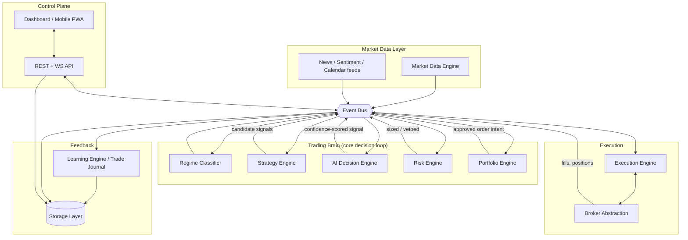
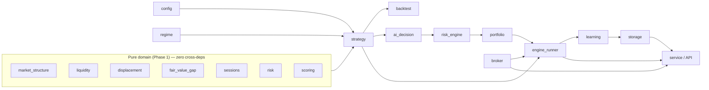
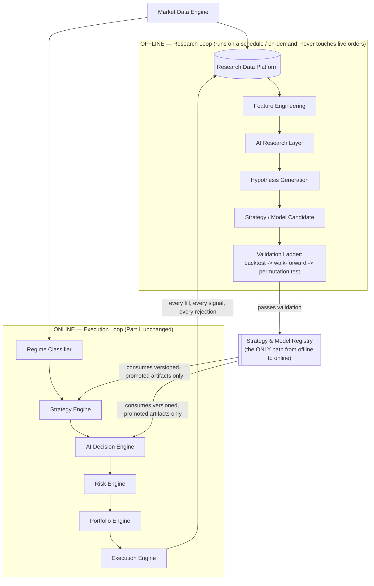
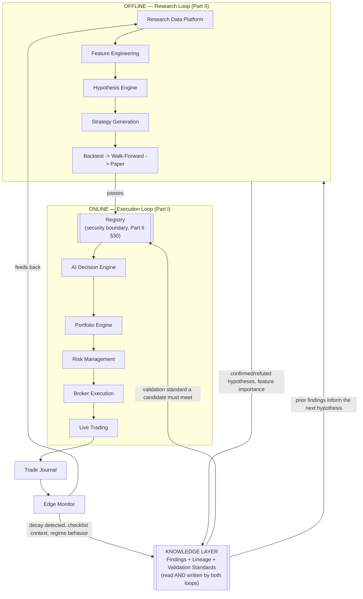

# Architecture Design Document — Autonomous Quantitative Research Operating System

*(f.k.a. "AI Trading Brain" — the rename tracks a real change in what this
platform is for, not a cosmetic one; see Part III's opening.)*

**Status:** **v1.0 — APPROVED AND FROZEN.** This document is the contract.
No module may be added, modified, or coupled in a way that violates the
boundaries, dependency graph, or principles below without an ADR first
(see `docs/adr/`). Changes to this document itself now happen only via
ADR, not by editing it directly — an ADR that changes the architecture
gets folded back in as a dated revision once accepted, but the day-to-day
record of *why* something changed lives in `docs/adr/`, not in silent
edits here.
**Scope:** The complete platform — data ingestion through execution,
learning, storage, knowledge, and operations — for a single-operator,
discretionary-override, low-frequency (2-5 high-conviction trades/day
across a handful of instruments) research and trading system, with a
near-term path to a Topstep-funded futures account and personal capital.

**Revision note, three parts, each building on the last without
discarding it:**
- **Part I (§0-§28)** — the execution platform: data in, decision, order
  out. The system that actually touches a broker.
- **Part II (§29-§36)** — the research platform: the execution platform
  becomes one subsystem (the *online loop*) of a larger system whose job
  is finding and validating statistical edge (the *offline loop*),
  joined by exactly one seam — the Registry. Supersedes Part I's §1
  diagram; extends everything else.
- **Part III (§37 onward)** — knowledge as the primary asset: the
  platform's long-term value isn't any strategy it's currently running
  (those decay, per §34) but the accumulated, curated record of what's
  been learned. Adds a cross-cutting Knowledge Layer, closes concrete
  reproducibility/provenance gaps, and explicitly rejects the
  institutional-scale versions of governance and capital allocation that
  a one-operator platform doesn't need yet.

---

## 0. Framing: what kind of system this actually is

Before any diagram, one fact should drive most of the decisions below: this
system is **event rate, not throughput, bound**. The stated goal is 2-5
high-probability trades a day out of a handful of instruments evaluated on
daily bars. That is not a hedge-fund matching-engine workload — it's closer
to a research process that happens to place its own orders. Institutional
platforms (QuantConnect, a real prop desk's internal stack) are built the
way they are because they run hundreds of strategies across thousands of
instruments at intraday-or-faster frequency, for multiple portfolio
managers, under regulatory audit requirements. Very little of that load
profile applies here.

That distinction matters because it's easy to over-architect from the
module list alone — "10 modules" reads as "10 microservices," and that
would be a mistake at this scale. The recommendation in this document is a
**modular monolith**: one deployable process, strict internal module
boundaries enforced by interfaces (not network calls), and an in-process
event bus. Every module boundary described below is real and enforced —
just not by a network hop. Section 20 (Deployment) and Section 21 (Scaling)
say explicitly what would have to change, and when, to justify splitting
any of this into separate services. Building that split now, before it's
needed, would add operational surface area (service discovery, distributed
tracing, network failure modes) in exchange for nothing — there is no load
today that a single Python process can't handle with room to spare.

This is the first place this document pushes back on the brief, so it's
stated up front rather than buried: **modular monolith now, with seams that
make a future service split additive, not a rewrite.** The rest of the
document is written to make that claim concrete and checkable, not just
asserted.

---

## 1. System overview



Everything downstream of the Event Bus reacts to events; nothing polls
another module's internals directly. That's the one architectural rule
that makes "add a strategy" or "add a broker" additive instead of invasive.

---

## 2. Module boundaries

| Module | Owns | Publishes | Subscribes to | Explicitly does NOT do |
|---|---|---|---|---|
| **Market Data Engine** | Connections to data sources, normalization | `MarketBarEvent`, `NewsEvent`, `SentimentEvent` | nothing (source of truth) | Never decides whether to trade — pure ingestion + normalization |
| **Regime Classifier** | Current market-state label per instrument | `RegimeChangedEvent` | `MarketBarEvent` | Never vetoes an individual trade — only gates which strategies are eligible |
| **Strategy Engine** | A registry of `Strategy` implementations | `SignalCandidateEvent` | `MarketBarEvent`, `RegimeChangedEvent` | Never sizes a position, never talks to a broker, never knows if the trade was allowed |
| **AI Decision Engine** | Confidence/probability scoring for a candidate | `ScoredSignalEvent` | `SignalCandidateEvent` | Never generates a signal from scratch, never predicts price — only scores evidence for a signal something else already proposed |
| **Risk Engine** | Per-trade and per-account risk rules | `RiskDecisionEvent` (approve/resize/reject) | `ScoredSignalEvent` | Never picks which trade to take among several — only accepts, rejects, or resizes what it's given |
| **Portfolio Engine** | Cross-instrument exposure, correlation, capital allocation | `OrderIntentEvent` | `RiskDecisionEvent` | Never re-litigates a risk decision — arbitrates when several approved trades compete for capital/exposure budget |
| **Execution Engine** | Order lifecycle state machine per instrument | `OrderPlacedEvent`, `OrderFilledEvent`, `OrderFailedEvent` | `OrderIntentEvent`, broker fill callbacks | Never decides whether a trade is good — only whether it can be executed safely |
| **Broker Abstraction** | One connection per broker, translates generic orders to broker-specific calls | broker-native fills → normalized events | `OrderPlacedEvent` | Never contains strategy or risk logic |
| **Learning Engine** | Trade journal, setup/outcome dataset | none (terminal consumer) | almost everything (it's an observer of the whole event stream) | Never feeds back into live decisions automatically — human-reviewed only (see §14) |
| **Storage Layer** | Durable state: trades, signals, settings, regime history | n/a | n/a (called directly, not via bus, for read paths) | Never contains business logic |
| **API / Control Plane** | Read state, issue commands (enable/disable, kill switch, flatten) | `SettingsChangedEvent`, `KillSwitchEvent` | reads from Storage | Never on the decision path — a human or the UI can only turn things on/off or observe, never inject a trade directly |

This table is also the enforcement mechanism: a code review question for
every PR becomes "which row does this file belong to, and does it stay
inside that row's columns?"

---

## 3. Data flow (one full cycle, concretely)

1. **Market Data Engine** polls/streams a source, normalizes to a `Candle`/`Bar`, publishes `MarketBarEvent(symbol, bar)`.
2. **Regime Classifier** consumes the bar (plus its own rolling state), may publish `RegimeChangedEvent(symbol, regime, confidence)` if the label changed.
3. **Strategy Engine** consumes the bar. For each registered strategy eligible under the current regime, calls `strategy.find_candidate(...)`. Zero or more strategies may each publish a `SignalCandidateEvent`.
4. **AI Decision Engine** consumes each candidate independently, publishes `ScoredSignalEvent(candidate, confidence, rationale)`. Below a configured confidence floor, the event still fires (for the Learning Engine's benefit — "we saw a setup and declined it" is data) but is marked `enter=False`.
5. **Risk Engine** consumes `ScoredSignalEvent` where `enter=True`, runs the validator pipeline (§11), publishes `RiskDecisionEvent(approved | resized | rejected, reason)`.
6. **Portfolio Engine** consumes approvals, checks aggregate exposure/correlation/capital budget across all open + pending positions, publishes `OrderIntentEvent` for what actually gets sent, or a rejection if the portfolio is already full.
7. **Execution Engine** consumes `OrderIntentEvent`, places the order via **Broker Abstraction**, tracks the resting-order → fill → bracket-exit lifecycle already implemented in `LiveEngine` today.
8. **Broker Abstraction** reports fills/positions back onto the bus as `OrderFilledEvent`, `PositionClosedEvent`.
9. **Learning Engine** listens to the entire stream (candidates seen, confidence scores, risk decisions, fills, closes) and writes a complete record per setup — not just per trade — to **Storage**.
10. **API / Control Plane** reads Storage + current in-memory state for the dashboard, and is the only path by which a human changes `Settings` or hits the kill switch — both of which publish events the relevant modules subscribe to, never a direct method call into another module's internals.

Every step is a **pure event transformation**: consume one event type,
publish zero or more of another. That's what makes a golden-master test
(§24) meaningful — replay the same `MarketBarEvent` sequence and the whole
chain downstream is byte-reproducible, given deterministic strategies and a
fixed AI-model version.

---

## 4. Event flow / Event Bus design

### Canonical event types

```
MarketBarEvent          {symbol, bar, source, received_at}
RegimeChangedEvent      {symbol, regime, confidence, as_of}
SignalCandidateEvent    {strategy_name, symbol, candidate, generated_at}
ScoredSignalEvent       {candidate, confidence, enter, rationale, model_version}
RiskDecisionEvent       {candidate, decision, size, reason, rules_version}
OrderIntentEvent        {candidate, size, account_id}
OrderPlacedEvent        {order_id, candidate, broker}
OrderFilledEvent        {order_id, fill_price, fill_qty, timestamp}
PositionClosedEvent     {order_id, exit_price, outcome, realized_r}
SettingsChangedEvent    {field, old_value, new_value, changed_by}
KillSwitchEvent         {active, triggered_by, reason}
```

Every event carries `trade_id` once one exists, so the full lifecycle of a
single decision — candidate → score → risk → order → fill → close → journal
— can be reconstructed by filtering on one ID. This is the backbone of
§22 (Logging) and §14 (Learning Engine).

### Implementation: in-process now, swappable later

The codebase already has three independent, ad-hoc versions of "publish an
event to whoever's listening" — `PaperBroker.subscribe_bars`,
`AppState.wire_broker`'s callback wiring, and `ConnectionManager`'s
WebSocket broadcast. That's the tell that an event bus is already the
implicit shape of this system; it just isn't named or unified yet.

Recommendation: introduce one `EventBus` defined as a small `Protocol`
(`publish(event) -> None`, `subscribe(event_type, handler) -> None`), with
an in-memory `asyncio`-based implementation as the only one that exists
today. Every module above talks to the bus, never to another module's
methods directly. Because the interface is a `Protocol`, a Redis Streams
or NATS-backed implementation is a drop-in replacement later — nothing
above it changes. That's the concrete seam that makes "split into
services later" a real, low-risk option instead of a promise.

**Not recommended now:** Kafka, RabbitMQ, or any broker requiring its own
ops (clustering, partitioning, retention policy). At 2-5 signals/day, the
entire event history for a year fits in memory; a durable external broker
solves a durability/throughput problem this system doesn't have. Storage
(§15) is the durability layer instead — every event that matters is
persisted synchronously to SQLite before the handler returns, which is a
far simpler durability story than standing up a message broker.

---

## 5. Service boundaries (today vs. future)

**Today: one deployable unit.** Everything in §1's diagram runs in one
Python process (the FastAPI service already does this — it already hosts
the broker, the engine runner, and the API in one `uvicorn` process).

**The one thing that should be allowed to run separately, when it's worth
it:** Market Data ingestion. It's I/O-bound, can crash/retry independently
of the decision loop without taking the whole system down, and is the one
place external rate limits (Yahoo/Polygon/news APIs) live. Recommendation:
keep it in-process today (it already is — `live_feed.py`), but design its
interface (§9's Market Data abstraction) so it could become a small
separate poller process publishing onto a shared queue without the rest of
the system noticing, the day that's actually necessary (e.g., a data
source needs a dedicated always-on connection the main process's restart
cycle would disrupt).

**The other candidate for a future split: Execution.** If this ever needs
to be colocated with a broker's matching engine for latency reasons (not a
concern at daily-bar, 2-5-trades/day cadence, but flagged for honesty),
Execution + Broker Abstraction is the pair that would move together.

Nothing else on the list has a real reason to be a separate service at
this system's actual load, and splitting them would only add failure
modes (network partition between "Risk Engine" and "Portfolio Engine" is
not a problem this system needs to solve).

---

## 6. Dependency graph



**Enforced rules** (checked by a lint/import-boundary test, not just
convention — see §24):

- Phase-1 domain modules never import each other's siblings except through `market_structure.Candle` as the shared vocabulary — already true today.
- `broker/` never imports `strategy` — already true today (this is why `LiveEngine` takes a `Strategy` as a constructor argument instead of hard-importing one).
- `service/` (the API layer) may depend on everything, but nothing may depend on `service/` — the control plane is a consumer, never a dependency.
- `learning/` and `storage/` may be depended on by anything, but depend on nothing above them — they're leaves, matching their role as terminal observers.
- New: `ai_decision` depends only on `scoring`'s `Tier`/`ChecklistInputs` vocabulary and its own model interface — never on `strategy` internals, so a strategy never needs to know which AI backend is scoring it.

---

## 7. Broker abstraction

Already built and correctly shaped (`trading_brain/broker/base.py`):
`Broker` ABC — `connect/disconnect/connection_state/subscribe_bars/
on_connection_state_change/place_order/cancel_order/flatten_all/
get_positions/get_account_summary`, with `PaperBroker` and `IBKRBroker`
as implementations. This is the one module in the current codebase that
already matches the target architecture with no changes needed.

**Extensions required for the stated roadmap:**

- **Alpaca adapter** — same interface, new implementation. No changes to `Strategy`, `RiskEngine`, or `ExecutionEngine` required — this is the proof the abstraction is doing its job.
- **Topstep execution** — Topstep accounts trade through a third-party platform (Rithmic, Tradovate, or NinjaTrader depending on the plan), not a direct Topstep API. This needs its own adapter once the platform is confirmed (open item from the earlier roadmap discussion), and — critically — a `FundedAccountRules` validator (§11) that enforces the EOD-trailing-drawdown / consistency-rule logic already built and tested in `trading-bot/bot/propfirm/calculator.py`. That logic should be promoted into the Risk Engine as a pluggable `AccountRules` policy, not reimplemented.
- **Idempotency contract**: every `OrderRequest` must carry a client-generated `trade_id` so a retried `place_order` call after a network timeout can't double-fill. `PaperBroker`/`IBKRBroker` don't enforce this today — it should be added to the `Broker` ABC's contract explicitly, with a test that asserts a duplicate `trade_id` is a no-op.

---

## 8. Strategy abstraction

Already built this session (`trading_brain/strategy.py`): `Strategy` ABC,
`TradeCandidate`, `SmartMoneyConceptsStrategy` as the one concrete
implementation, `StrategyEngine` as a multi-strategy container.

**One real design decision this document surfaces and recommends
resolving before more strategies are added:** `StrategyEngine.find_candidate`
today returns the *first* candidate any strategy produces — correct
(trivially) for one strategy, but silently wrong once a second exists,
because it means strategy registration order determines which setup wins
on a day both fire. Recommendation: `StrategyEngine` should collect *all*
candidates from *all* eligible strategies for a given bar and pass the
full list downstream; **arbitration among simultaneous candidates belongs
to the Portfolio Engine** (§12), which has the cross-instrument, cross-
strategy context to make that call (capital budget, correlation, "we
already have 3 of our 5 max positions open") — not the Strategy Engine,
which by design knows nothing outside its own setup.

---

## 9. Market data abstraction

Not yet a real abstraction — `data_loader.py` (CSV) and `live_feed.py`
(Yahoo Finance polling) are two independent, un-unified code paths today.
Recommendation:

```
class MarketDataSource(ABC):
    def historical(self, symbol, start, end) -> List[Candle]: ...
    def subscribe(self, symbol, on_bar: Callable) -> None: ...
```

`CSVSource`, `YahooFinanceSource`, and later `PolygonSource`/
`AlpacaDataSource`/`BinanceSource` all implement this. A `NewsSource` /
`SentimentSource` / `FearGreedSource` family gets a parallel, simpler
interface (`latest() -> Event`) since they're not bar-shaped data — trying
to force news into the `Candle` schema would be a modeling mistake, not a
simplification.

**Explicitly out of scope for now:** intraday data from any source. Every
existing calibration (`liquidity_tolerance`, displacement thresholds,
session gating) was tuned against daily bars — see `engine_runner.py`'s
own documented reasoning for why a real timestamp is stripped before
reaching the strategy. Adding a second timeframe is a calibration project,
not a data-source-abstraction project, and mixing them would silently run
an unvalidated strategy at an unvalidated frequency.

---

## 10. AI Decision Engine architecture

The brief's framing — "the AI should not predict prices, its job is to
determine whether there's enough statistical edge to enter" — is the right
instinct, and it's worth being explicit about *why* it's right
architecturally, not just philosophically: a price predictor is
unbounded, hard to backtest honestly (leaks look-ahead easily), and hard
to explain after the fact. A confidence/evidence gate over a *strategy's
own candidate* is bounded, directly backtestable (score every historical
candidate, check calibration against realized outcome), and produces an
auditable rationale per decision — which is exactly what the Learning
Engine and any future compliance/journaling need.

**One upgrade recommended over the brief's framing:** don't stop at a
binary "enough evidence, yes/no." The engine should output a **calibrated
win-probability estimate** for the candidate, not just a confidence score.
The distinction matters downstream: a bare confidence score is only usable
as a threshold gate, but a calibrated probability can feed directly into
the Risk Engine's position-sizing math (a Kelly-fraction-style sizing
input, similar in spirit to `TradeDistribution.win_prob` already used in
`trading-bot`'s prop-firm Monte Carlo calculator) instead of sizing being
blind to how confident the system actually is in a given setup. "Enter or
don't" is a special case of "how much," not a separate concept.

```
class AIDecisionEngine(ABC):
    def evaluate(self, candidate: TradeCandidate, context: MarketContext) -> Decision: ...

@dataclass
class Decision:
    win_probability: float      # calibrated, not a raw model score
    enter: bool                 # win_probability >= configured floor
    rationale: str              # human-readable, logged verbatim
    model_version: str          # every decision is reproducible against the model that made it
```

**v0 implementation, today:** the existing `scoring.py` (`ChecklistInputs`
→ `Tier` → `score_setup`) *is* a rules-based `AIDecisionEngine` already —
deterministic, fully explainable, zero training data required. It should
be wrapped behind this interface as `RuleBasedDecisionEngine`, not
replaced. A statistically-trained model is a legitimate v1, but per this
project's own established discipline (never trust an unvalidated claim),
any new model must run in **shadow mode** — scored and logged, never
gating real orders — for a defined evaluation window, and be compared
against the rule-based baseline's calibration before it's ever allowed to
flip `enter`. This mirrors exactly the "no capital without independent
verification" rule already governing the walk-forward → paper → live
progression; a model swap is not exempt from that ladder just because it's
software instead of a strategy.

---

## 11. Risk engine architecture

A pipeline of composable validators, each one of: **approve / resize /
reject**. Any single rejection blocks the trade — "risk management must
always override every strategy" is enforced by making rejection
short-circuit the pipeline, not by convention.

```
class RiskValidator(ABC):
    def check(self, candidate, account_state) -> RiskCheckResult: ...

Pipeline (order matters — cheapest/most-restrictive checks first):
  1. KillSwitchValidator          — hard stop, no exceptions
  2. InstrumentEnabledValidator   — is this symbol turned on
  3. TierFloorValidator           — does it meet the configured min tier / win-probability floor
  4. PositionSizeValidator        — account risk% -> contracts, capped by max_contracts
  5. DailyLossLimitValidator      — halts new entries, does not touch open positions
  6. WeeklyLossLimitValidator     — same shape as daily, longer window (net-new vs today)
  7. MaxConcurrentPositionsValidator — net-new
  8. AccountRulesValidator        — pluggable: personal account = no-op today; funded account
                                     (Topstep) = EOD-trailing drawdown + consistency rule,
                                     ported from trading-bot/bot/propfirm/calculator.py's
                                     already-tested _floor_for() logic
  9. TrailingStopValidator        — net-new, intra-trade rather than pre-trade
```

Every validator's decision (including approvals) is logged with its
reasoning — the Learning Engine needs "why didn't we take that S-tier
setup" (answer: `DailyLossLimitValidator` had already halted the day) as
much as it needs winning trades.

The **daily-loss-limit-is-not-terminal** bug already found and fixed once
in `trading-bot`'s risk manager, and modeled correctly (locks out the rest
of the day, doesn't end the account) in the prop-firm calculator, is the
kind of subtle-but-critical rule this pipeline shape is specifically
designed to prevent from being reinvented incorrectly a third time.

---

## 12. Portfolio engine

**This module does not exist today, and its absence is a real, currently-
live gap**, worth stating plainly: nothing in the current system stops
four correlated long positions (say, GC=F, ES=F, CL=F, and EURUSD=X all
long into the same macro risk-on move) from opening simultaneously, because
each `LiveEngine` instance only knows about its own symbol. That's fine at
today's single-strategy, single-instance-per-symbol scale, but it's the
first thing that breaks the moment a second strategy or a second
instrument correlated with the first goes live unattended.

Responsibilities:
- Aggregate exposure across all open + pending positions (net & gross).
- Correlation-aware capital allocation (a crude but honest v0: a
  configured correlation-group cap — e.g., "no more than 2 concurrent
  positions across {GC=F, CL=F}" — before attempting real covariance
  estimation, which needs more history than this system has accumulated).
- Arbitration among multiple `RiskDecisionEvent` approvals competing for
  the same capital/exposure budget on the same bar (§8's deferred
  decision resolves here).
- Enforces `max_simultaneous_positions` platform-wide, not per-symbol.

This sits between the Risk Engine (which answers "is *this* trade OK on
its own") and the Execution Engine (which just executes what it's told) —
the Portfolio Engine is the only module allowed to say "this trade is fine
in isolation but the portfolio doesn't have room for it right now."

---

## 13. Execution engine

Already built (`LiveEngine`): a documented state machine (flat → pending →
open → flat), reconciliation against broker truth
(`_sync_open_state`/`_sync_pending_state`), timeout handling
(`max_pending_candles`), invalidation-before-stop exit logic. This module
is close to correct as-is; extensions needed:

- **Idempotent order placement** via the `trade_id` contract from §7.
- **Retry/backoff policy** for broker calls that fail transiently (network
  blip, broker-side rate limit) vs. fail permanently (rejected order,
  insufficient margin) — today errors during `broker.connect()` are caught
  and logged (`service/main.py`'s lifespan) but there's no retry policy for
  in-flight order calls yet.
- **Explicit failure event** (`OrderFailedEvent`) so the Learning Engine
  and Portfolio Engine both know a slot opened back up when an order
  didn't go through, rather than silently stalling in `pending`.

---

## 14. Learning engine

**Does not exist yet.** Records every setup the Strategy Engine produced —
not just filled trades — with full context:

```
TradeJournalEntry:
  trade_id, symbol, strategy_name, generated_at
  candidate (entry/stop/target/invalidation)
  tier, checklist                         # from scoring.py
  ai_win_probability, ai_rationale, model_version
  regime_at_signal
  risk_decision, risk_reason
  portfolio_decision                      # net-new
  outcome (filled/unfilled/rejected), fill_price, exit_price, realized_r
  account_mode (paper | live | funded)
```

Recording *unfilled and rejected* setups, not just closed trades, is what
makes this genuinely a learning dataset rather than a trade log — it's the
only way to later ask "how many A-tier setups did the risk engine block
last month, and were they right to be blocked?"

**Explicit non-goal, stated as firmly as the brief's own "no capital
without proof" rule:** no automatic retraining or strategy-parameter
self-modification from this data. It feeds human review and, eventually,
offline model evaluation for the AI Decision Engine's shadow-mode
comparisons (§10) — never a live feedback loop that changes behavior
without a human approving the change and re-running the paper-trading gate.
An autonomous system that quietly rewrites its own risk tolerance from its
own recent P&L is a foreseeable and serious failure mode, not a feature to
defer — it's one to explicitly rule out here.

---

## 15. Storage layer

**Current state, honestly:** there is effectively no persistent storage.
`settings.json` persists risk/instrument toggles; everything else —
`PaperBroker`'s fills, `LiveEngine`'s state, any trade history — lives in
process memory and is lost on restart. For a system meant to trade
unattended overnight, this is a real gap, not a nice-to-have.

**Recommendation: SQLite**, not Postgres, at this scale. Single file,
zero operational overhead, ACID, trivially backed up (copy the file),
and 2-5 trades/day for years is a rounding error against SQLite's actual
capacity. Upgrade path to Postgres is explicit and cheap *if* the system
ever becomes genuinely multi-process or multi-user — not before.

Core tables (see §18 for the full schema): `trades`, `signals` (every
candidate evaluated, filled or not — the Learning Engine's raw material),
`regime_history`, `settings_audit_log`, `account_snapshots` (equity curve).

---

## 16. Event bus

Covered in §4. Restated here only to note its place in the storage story:
every event that needs to survive a restart is written to SQLite
synchronously as part of its handler (e.g., `SignalCandidateEvent` →
`signals` row) — the event bus itself stays in-memory and ephemeral; durability
is Storage's job, not the bus's. This is a deliberate simplification: it
avoids needing the bus itself to be crash-safe, which is what would force
a heavier message-broker choice.

---

## 17. APIs

Current REST + WS surface (`service/api.py`, `service/ws.py`) is already
correctly shaped as a **read + command** control plane:
`GET /api/settings|account|positions|orders|status|candles`,
`PUT /api/settings`, `POST /api/flatten-all`, plus a WS broadcast of
`snapshot/positions/account/order/connection/settings/candle` messages.

**Invariant worth stating explicitly because it's easy to erode by
accident:** the API is never on the decision path. It can read state and
issue a small, fixed set of commands (toggle an instrument, change risk%,
hit the kill switch, flatten everything) — it can never inject a trade
directly or bypass the Strategy → AI → Risk → Portfolio pipeline. This is
both a security property (§25) and a correctness one: it guarantees every
trade that ever happens went through the same validated pipeline, whether
it was 3am and unattended or triggered by a human clicking a button.

**Gap to flag:** the API currently binds to `127.0.0.1` with no auth,
which is correct for local-only use but is exactly what made the earlier
"access the dashboard from my phone" request (from a prior session) an
open problem rather than a solved one — see §25.

---

## 18. Database schema

```sql
-- One row per candidate a strategy produced, filled or not.
-- This is the Learning Engine's primary table.
CREATE TABLE signals (
    trade_id            TEXT PRIMARY KEY,
    symbol              TEXT NOT NULL,
    strategy_name       TEXT NOT NULL,
    generated_at         TIMESTAMP NOT NULL,
    direction            TEXT NOT NULL,          -- bullish | bearish
    entry, stop_loss, take_profit, invalidation_price REAL NOT NULL,
    tier                 TEXT NOT NULL,
    checklist_json        TEXT NOT NULL,          -- ChecklistInputs, serialized
    ai_win_probability     REAL,
    ai_rationale           TEXT,
    ai_model_version        TEXT,
    regime_at_signal        TEXT,
    risk_decision            TEXT NOT NULL,        -- approved | resized | rejected
    risk_reason               TEXT,
    portfolio_decision         TEXT,
    account_mode                TEXT NOT NULL      -- paper | live | funded
);

-- One row per trade that actually filled -- FK back to signals.
CREATE TABLE trades (
    trade_id       TEXT PRIMARY KEY REFERENCES signals(trade_id),
    broker_order_id TEXT,
    filled_at        TIMESTAMP,
    fill_price        REAL,
    quantity           INTEGER,
    exit_index          INTEGER,
    exit_price            REAL,
    exit_at                TIMESTAMP,
    outcome                  TEXT,               -- win | loss | invalidated | open
    realized_r                 REAL
);

CREATE TABLE regime_history (
    id           INTEGER PRIMARY KEY AUTOINCREMENT,
    symbol        TEXT NOT NULL,
    regime         TEXT NOT NULL,
    confidence      REAL NOT NULL,
    as_of             TIMESTAMP NOT NULL
);

CREATE TABLE settings_audit_log (
    id           INTEGER PRIMARY KEY AUTOINCREMENT,
    field         TEXT NOT NULL,
    old_value      TEXT,
    new_value       TEXT,
    changed_by       TEXT NOT NULL,               -- 'human:dashboard' | 'human:api' | 'system:kill_switch'
    changed_at         TIMESTAMP NOT NULL
);

CREATE TABLE account_snapshots (          -- equity curve, one row per bar or per material event
    id          INTEGER PRIMARY KEY AUTOINCREMENT,
    account_mode TEXT NOT NULL,
    equity        REAL NOT NULL,
    open_positions INTEGER NOT NULL,
    as_of            TIMESTAMP NOT NULL
);
```

Indexes on `signals(symbol, generated_at)` and `trades(filled_at)` cover
the dashboard's and Learning Engine's actual query patterns (recent
activity, per-symbol history) without needing anything more elaborate.

---

## 19. Folder structure

```
ai-trading-brain/
  trading_brain/
    market_structure.py, liquidity.py, displacement.py,   # Phase 1 domain,
    fair_value_gap.py, sessions.py, risk.py, scoring.py    # unchanged
    config.py                     # BacktestConfig (already extracted)
    strategy.py                   # Strategy, TradeCandidate, StrategyEngine (already built)
    regime.py                     # NEW — RegimeClassifier
    ai_decision.py                # NEW — AIDecisionEngine, RuleBasedDecisionEngine
    risk_engine/                  # NEW — package: pipeline + individual validators
      __init__.py, pipeline.py, validators.py, account_rules.py
    portfolio.py                  # NEW — PortfolioEngine
    events.py                     # NEW — EventBus protocol + in-memory impl + event dataclasses
    learning/                     # NEW — package
      __init__.py, journal.py
    storage/                      # NEW — package
      __init__.py, schema.sql, repository.py
    market_data/                  # NEW — package, replaces data_loader.py + parts of live_feed.py
      __init__.py, base.py, csv_source.py, yahoo_source.py
    backtest.py                   # unchanged shape, now strategy-pluggable
    walk_forward.py               # unchanged
    broker/                       # unchanged (already correctly shaped)
      base.py, paper.py, ibkr.py, alpaca.py (NEW), engine_runner.py, settings.py
  service/                        # API / control plane, unchanged shape
    main.py, api.py, ws.py, state.py, candles.py, live_feed.py, serialize.py
  dashboard/                      # UI, deprioritized per the brief — kept, not expanded
  docs/
    ARCHITECTURE.md               # this document
  tests/
    (mirrors trading_brain/ 1:1, plus tests/integration/ for full-pipeline event-flow tests)
```

Every `NEW` module is additive to the existing tree — nothing above
requires moving or renaming code that already works and is tested.

---

## 20. Deployment architecture

**Today, and for the foreseeable stated scale:** one process, one machine.
`uvicorn service.main:app` already runs the whole system. Recommendation:
run it under real process supervision (`launchd` on macOS or `systemd` on
a small always-on VPS/cloud box) instead of a foreground terminal, with
auto-restart on crash — the current "leave a Terminal window open" mode is
exactly the kind of thing that breaks unattended overnight operation the
brief explicitly wants ("while I sleep").

**Deliberately not recommended:** Docker/Kubernetes, multi-region,
autoscaling groups, or any of the infrastructure a typical "production
platform" checklist would suggest. None of it addresses a real constraint
this system has. A single reliable machine with process supervision,
backups of the SQLite file, and an alerting heartbeat (§23) covers the
actual risk (the process dies at 2am with an open position) far more
directly than infrastructure aimed at horizontal scale this system doesn't
need.

**One deployment property that does matter, precisely because trading
happens unattended:** a documented, tested **fail-safe default** — if the
process crashes or loses broker connectivity, existing bracket orders
(stop/target) must already be resting at the broker (they are, per
`paper.py`'s and `IBKRBroker`'s bracket handling), so a dead process
doesn't leave a naked open position. That property should be a standing
test (§24), not just current behavior.

---

## 21. Scaling strategy

Three genuinely different axes, worth separating because they have
different answers:

1. **More instruments/strategies, same (daily) cadence.** In-process
   scales to hundreds of symbols and strategies at this bar frequency
   without strain — this is not a real constraint for years.
2. **Higher frequency (intraday) data.** Explicitly *not* a scaling
   question — it's a calibration and validation question (§9). Don't
   solve it with infrastructure; solve it by re-running the entire
   backtest → walk-forward → paper gate at the new frequency before any
   part of the system trusts intraday signals.
3. **Multiple accounts** (a Topstep-funded account alongside personal
   capital, eventually multiple funded accounts). Model each account as
   its own `PortfolioEngine` instance under one supervising process, each
   with its own `AccountRules` policy in the Risk Engine (§11) — not a new
   architecture, just multiple instances of an existing one. This is the
   point at which running two supervised processes (one per account) might
   start being simpler than one process managing both, but that's an
   operational choice, not an architectural one, and can be decided when
   it's actually in front of you rather than now.

---

## 22. Logging

Structured logging already exists (Python `logging`, used consistently
across `service/`). Recommendation: thread `trade_id` (§4) through every
log line touching a specific signal/trade, so `grep`-ing one ID reconstructs
the full lifecycle across modules — this is the low-cost version of
distributed tracing, appropriate at single-process scale, and it directly
answers the debugging question this system will actually face ("why did
this specific trade happen / not happen").

## 23. Monitoring

- **Heartbeat**: `/api/status` already exists; extend it to report
  *staleness* explicitly — last successful market-data poll timestamp per
  source, not just "is the process up." A silently-stale data feed
  (Yahoo Finance rate-limited, say) that never crashes the process is a
  more dangerous failure mode than a crash, because nothing currently
  surfaces it.
- **Decision visibility, not just outcome visibility**: log/alert on
  Risk Engine and Portfolio Engine *rejections* of otherwise-good setups,
  not just fills — "why didn't it trade" needs to be answerable without
  reading source code.
- **Alerting**: given single-operator, unattended operation, a push
  notification (or at minimum an email) on kill-switch activation,
  broker disconnect beyond a threshold, or an unhandled exception in the
  decision loop is a real requirement, not a polish item — the brief's
  own "while I sleep" framing means silent failure is the single worst
  outcome this system can produce.

## 24. Testing strategy

Already-established discipline, restated as a standing policy rather than
an ad hoc habit:

- **Unit tests per module**, mirroring the folder structure (already true — 235 tests today).
- **Verified mechanical refactors**: any code-movement-only change (like today's Strategy extraction) must show identical test results and identical walk-forward output before/after — already the practiced standard this session, worth writing down as a rule.
- **Import-boundary tests**: a small test that walks the dependency graph (§6) and fails if, e.g., `broker/` imports `strategy` directly, or `service/` is imported by anything under `trading_brain/` — turns the dependency graph from a diagram into an enforced invariant.
- **Golden-master regression per strategy**: a fixed historical slice + fixed config, asserting exact trade-by-trade output — catches accidental behavior drift in a strategy the moment it happens, not months later in a walk-forward run.
- **Out-of-sample discipline**: walk-forward's train/test separation is already correct; extend the same principle to the AI Decision Engine (§10) — any model's calibration must be judged only on signals it never saw during fitting.
- **Chaos-lite tests for Execution**: simulated broker disconnects, rejected orders, and duplicate `place_order` calls (idempotency, §7/§13) — the brief explicitly asks for "handles retries and broker failures safely," which needs a test that actually breaks the broker connection mid-order, not just a hopeful code comment.
- **Mandatory paper-trading soak period** before any strategy or model touches real capital, personal or funded — already the project's own rule; this document just makes it a Risk Engine-enforced account-mode gate (§11) rather than a manual discipline.

## 25. Security model

- **Broker credentials**: env vars / untracked secrets file only — already the pattern (`IBKR_HOST`/`IBKR_PORT`/`IBKR_CLIENT_ID` etc.), extend identically to Alpaca/Topstep-platform credentials. Never in `settings.json` (which is fine to expose over the API) or committed to git.
- **API surface**: `127.0.0.1`-only today is a *correct* default, not a temporary gap — but it means "check the dashboard from my phone" (an earlier, real request) is unsolved by design, not forgotten. Two honest options, no third: (a) a authenticated reverse tunnel/VPN to the home machine, or (b) deploy the service on a small always-on box with real auth (token-based, HTTPS) in front of the API. Recommendation: (b), once this system is trading unattended anyway — a machine that needs to be reliable for overnight trading might as well be the one reachable from a phone, rather than solving reliability and remote access as two separate problems.
- **Kill switch must be reachable independent of the main decision loop's health** — if the event-processing loop is wedged (not crashed, just stuck), the kill switch endpoint should still work. This argues for the kill-switch check happening at the Execution Engine/broker boundary (§11's first, cheapest validator) rather than requiring the full pipeline to be healthy to honor it.
- **No credential ever appears in a log line, event payload, or the Learning Engine's journal** — worth stating as a rule precisely because the journal is designed to capture "everything" (§14); "everything about a trade decision," not literally everything in scope at the time.

## 26. Future extensibility

What this architecture is specifically designed to make additive, and why:

| Future need | Why it's additive, not a rewrite |
|---|---|
| New strategy (Trend Following, Breakout, Mean Reversion, Order Blocks) | Implements `Strategy`, registers with `StrategyEngine` — nothing else in the pipeline changes |
| New broker (Alpaca, a Topstep execution platform) | Implements `Broker` — `ExecutionEngine`/`RiskEngine`/`Strategy` never reference broker specifics |
| New data source (Polygon, Binance, news/sentiment) | Implements `MarketDataSource` (or the simpler event-source interface for non-bar data) |
| Statistically-trained AI model | Implements `AIDecisionEngine`, runs in shadow mode against the rule-based baseline before ever gating |
| Second funded/personal account | New `PortfolioEngine` + `AccountRules` instance under the same process |
| Real distributed load (many strategies, many accounts, intraday) | `EventBus` Protocol swaps its in-memory impl for a durable one; Market Data / Execution are the two modules already designed to split out first |
| Multi-user (not currently in scope, flagged for completeness) | Would require `account_id`/`user_id` scoping threaded through Storage and the API's auth layer — the schema in §18 already has `account_mode` as a first pass at this, but real multi-tenancy is a materially bigger change than anything else in this table and shouldn't be assumed free |

---

## 27. Where this document disagrees with the brief, explicitly

Per your own instruction not to just implement the list as given — three
places this document takes a different position, stated plainly rather
than silently:

1. **Modular monolith, not 10 services.** Covered in §0/§5. The module
   list is right; treating each module as an independently deployed
   service is the wrong amount of infrastructure for 2-5 trades/day. The
   boundaries are real and enforced by interfaces + import-boundary tests,
   just not by a network hop, and the seams that would let a real split
   happen later are named explicitly (§5, §26) rather than assumed away.

2. **No message broker (Kafka/RabbitMQ) yet.** An `EventBus` exists as a
   named concept and a stable interface, but its first implementation is
   in-memory. Durability comes from writing to SQLite synchronously, not
   from a broker's own persistence. Reaching for Kafka here would be
   solving a throughput problem this system doesn't have at the cost of
   real operational complexity (a second stateful service to keep alive,
   monitor, and back up) that provides no benefit yet.

3. **The AI Decision Engine should output a calibrated win probability,
   not a bare confidence score.** The brief's "just answer enough
   evidence, yes/no" instinct is correct and is kept — but a probability
   estimate is strictly more useful than a threshold-gated confidence
   number: it can drive position sizing directly (§10, §11) instead of
   being a second, disconnected concept from risk sizing. Same
   philosophy, more principled output.

A fourth, smaller disagreement, flagged rather than silently adopted: a
**hard regime gate** ("the selected regime determines which strategies are
allowed to execute," as specified) is exactly what the brief asks for, and
is kept as the default — but it's worth naming the failure mode plainly:
a single misclassified regime bar can silently disable every strategy for
a period with no visible symptom other than "the system did nothing,"
which is easy to mistake for "no setups today" rather than "the regime
classifier was wrong." Recommendation: ship the hard gate as specified,
but have the Regime Classifier publish its confidence alongside the label
(already in `RegimeChangedEvent`'s shape, §4) and surface low-confidence
regime calls distinctly on the dashboard/logs (§22/§23) — visible, not
silently trusted.

---

## 28. What happens after approval

This document describes target shape, not a sprint plan. Once approved,
the recommended build order (unchanged in spirit from the brief's own
priority list, re-sequenced only where a dependency requires it) is:

1. **Storage layer + event bus** (§4, §15) — everything else needs
   somewhere to persist and a consistent way to publish, so this goes
   first even though it's not the most exciting module.
2. **Portfolio Engine** (§12) — closes the one currently-live gap
   (uncorrelated simultaneous positions) with the least new surface area.
3. **Risk Engine formalization** (§11) — promote the existing ad hoc
   checks (`BotSettings`'s daily drawdown, `risk.py`'s sizing) into the
   validator pipeline shape, port the Topstep `AccountRules` logic.
4. **Regime Classifier** (§3) — first real net-new "brain" module.
5. **AI Decision Engine v0** (§10) — wrap existing `scoring.py` behind the
   interface; no new model yet.
6. **Learning Engine + schema** (§14, §18) — now that every upstream
   module emits the events it needs to record.
7. Second strategy, second broker, statistically-trained AI model — in
   whatever order real priorities dictate, each additive per §26.

Each of these should land as its own reviewed, tested increment — not as
one large change — matching the discipline already used for every change
in this codebase so far.

---
---

# PART II — The Research Platform Reframe

## 29. Verdict up front, then the reasoning

The reframe is right, with one structural correction that changes how it
gets built, not whether it gets built.

**Accepted as stated:** the platform's real long-term product is a
research process that discovers and validates edge, not a fixed set of
hand-written strategies. Capturing every signal, rejection, and decision
as research data (not just closed trades) is correct and — worth saying
plainly — was already the direction Part I's schema (§18) was heading;
this reframe makes explicit what was implicit there.

**The correction:** "the Strategy Engine should no longer be the center"
is right about the *research* side and wrong if it's read as "the
execution loop should route through the research process on every
trade." Those need to stay two different systems, running at two
different cadences, joined by exactly one seam. Section 30 is the whole
argument for why; it's the single most important architectural decision
in this document, so it gets its own section before anything else.

Everything Part I built — the event bus, the `Strategy`/`Broker`/
`AIDecisionEngine` interfaces, the Risk/Portfolio pipeline, the schema —
does not get rebuilt. It becomes the **online execution loop**, one of
two halves. The other half, new in this part, is the **offline research
loop**. Part I's interfaces turn out to already be the correct seam
between them, which is a reason for more confidence in Part I, not a
reason to redo it.

## 30. Two loops, one registry — the corrected top-level architecture

Institutional quant shops (and this is worth being concrete about, since
"institutional-grade" is the stated bar) essentially never run hypothesis
generation, feature engineering, and model search in the same process, on
the same request path, as live order execution. Research runs in its own
environment, on its own schedule (nightly, weekly, on-demand), against
historical and delayed data, and is allowed to be slow, exploratory, and
occasionally wrong without consequence. Execution runs in a narrow,
heavily-tested, deliberately boring path that only ever does one thing:
take an already-validated, already-versioned strategy/model and run it
against live data under risk controls. The two are connected by a
**promotion gate** — nothing crosses from research to execution without
passing the same validation ladder Part I already established (backtest →
walk-forward → paper → live) and being written down as a versioned,
immutable artifact first.

The reason this separation matters here specifically, not just as
generic best practice: conflating them would mean a change to the
research pipeline — a new feature, a retrained model, an experimental
hypothesis — could reach live capital without going through Risk/
Portfolio/paper-trading gates, purely because it's "upstream" in one
unified pipeline. That's a real risk, not a hypothetical one, for a
system meant to trade unattended. Keeping research and execution as
separate loops, joined only by a versioned registry, is what makes it
structurally impossible for an in-progress research idea to place a live
order.



**What changed from Part I's §1 diagram:** nothing about the online loop's
internals — same modules, same order, same interfaces. What's new is
everything upstream of the Registry, and the Registry itself as an
explicit, enforced boundary rather than an implicit one. Part I's
`AIDecisionEngine.model_version` and `Strategy` interface were already
designed as if a registry existed on the other side of them (§10, §26)
— this section makes that real.

## 31. The Research Data Platform: right-sized, not a "data lake"

"Data Lake" is institutional vocabulary for a specific problem —
petabyte-scale, schema-on-read, distributed object storage, because the
data doesn't fit on one machine or in one query engine. This system's
actual data footprint: ~2,500 daily bars per instrument across a handful
of instruments (a few hundred thousand rows total, ever), plus a signals/
trades journal growing at a few thousand rows a year at generous
estimates. That is not a data lake problem. Calling it one and building
toward S3 + Parquet + a distributed query engine would be solving a
storage-volume problem this system doesn't have, at real operational cost
(a second stateful system to run, monitor, and pay for).

**Recommendation: DuckDB**, not a data lake, not a second database engine
alongside Part I's SQLite. DuckDB is an embedded, single-file, zero-ops
database purpose-built for exactly this shape of problem — moderate row
counts, wide feature tables, heavy analytical/columnar queries (rolling
correlations, multi-timeframe joins, feature backtests) — while still
being "just a file" operationally, same as SQLite. Recommendation:
consolidate Part I's SQLite tables (§18) and the new research tables
(§32) into one DuckDB file. DuckDB handles the low write-volume
transactional side (a few trades/signals a day) perfectly well and is
dramatically better than SQLite the moment feature engineering or
regime/correlation analysis runs an actual analytical query across years
of multi-instrument data. One engine, one file, one backup story — not
two databases with a sync problem between them.

**If raw data volume ever does grow past "fits comfortably in one
DuckDB file on a laptop"** — e.g., a future move into tick data or full
historical news text — the upgrade path is Parquet files on cheap object
storage with DuckDB (or a real query engine) reading over them directly.
That's a real, well-trodden path, and the point is: it's a *later*
decision, made when the data actually justifies it, not a default
starting posture.

## 32. What actually goes in the research schema

Extends Part I's §18 schema (`signals`, `trades`, `regime_history`
already capture most of the online loop's own decisions — that data
*is* research data, and needs no duplication, just no longer being
thought of as "just an operational log"). New tables:

```sql
-- Point-in-time-correct computed features. The core of the "Feature
-- Store" concept (§33) -- not a separate service, this table plus a
-- computation contract.
CREATE TABLE features (
    symbol           TEXT NOT NULL,
    as_of            TIMESTAMP NOT NULL,   -- the bar this feature is valid as of
    feature_name     TEXT NOT NULL,
    feature_version  TEXT NOT NULL,        -- ties value to the exact code that produced it
    value            DOUBLE,
    PRIMARY KEY (symbol, as_of, feature_name, feature_version)
);

-- Exogenous research inputs -- news/sentiment/macro -- kept separate
-- from bar-shaped market data, not forced into the same schema.
CREATE TABLE research_events (
    id               INTEGER PRIMARY KEY,
    source           TEXT NOT NULL,        -- 'news' | 'sentiment' | 'macro_calendar' | 'fear_greed'
    symbol            TEXT,                -- nullable: some events are market-wide
    occurred_at         TIMESTAMP NOT NULL,
    payload_json          TEXT NOT NULL,
    ingested_at             TIMESTAMP NOT NULL
);

-- Execution quality -- broker fill vs. intended price, per trade.
-- Feeds both Edge Monitoring (§34) and any future execution-cost model.
CREATE TABLE execution_quality (
    trade_id          TEXT PRIMARY KEY REFERENCES trades(trade_id),
    intended_price     DOUBLE NOT NULL,
    fill_price          DOUBLE NOT NULL,
    slippage             DOUBLE NOT NULL,     -- fill - intended, signed
    spread_at_fill        DOUBLE,
    broker                 TEXT NOT NULL
);

-- One row per research run -- backtest, walk-forward, hypothesis test.
-- This IS the "Experiment Tracking" ask (§33), sized for one operator.
CREATE TABLE experiments (
    experiment_id      TEXT PRIMARY KEY,
    experiment_type      TEXT NOT NULL,       -- 'backtest' | 'walk_forward' | 'hypothesis_test' | 'model_training'
    code_git_hash          TEXT NOT NULL,      -- exact code that produced this result
    dataset_snapshot_id      TEXT NOT NULL,    -- which slice of features/data was used
    config_json                TEXT NOT NULL,
    metrics_json                 TEXT NOT NULL, -- Sharpe, total_r, win_rate, p-value, etc.
    started_at, completed_at       TIMESTAMP
);

-- The promotion gate itself -- one row per versioned artifact that has
-- ever been allowed to cross from offline to online (§30).
CREATE TABLE registry (
    artifact_id         TEXT PRIMARY KEY,
    artifact_type          TEXT NOT NULL,     -- 'strategy' | 'ai_model'
    version                    TEXT NOT NULL,
    source_experiment_id         TEXT REFERENCES experiments(experiment_id),
    status                          TEXT NOT NULL,  -- 'research' | 'shadow' | 'paper' | 'live' | 'retired'
    promoted_at, promoted_by            TIMESTAMP, TEXT
);
```

Nothing here is new infrastructure — it's four tables and a naming
discipline, all inside the same DuckDB file as Part I's operational
tables. That's deliberate: the ambition is in what gets *asked* of this
data (§34-§36), not in the storage technology holding it.

## 33. The 17 proposed components, evaluated one by one

Grouped by verdict, with reasoning. "Keep" means: build it, roughly as
proposed. "Merge" means: real concept, wrong granularity — it becomes a
capability of a broader module already in this document, not its own
subsystem. "Defer" means: correct idea, wrong right now — premature at
current data volume/instrument count, revisit at a stated trigger.
"Reject as a separate system" means: the institutional version of this
solves a problem (scale, multi-tenancy, low-latency serving) this
platform doesn't have, and building it that way would be pure overhead.

| Component | Verdict | Why |
|---|---|---|
| **Feature Store** | **Keep**, right-sized | §32's `features` table + a versioning convention. Not Feast/Tecton (built for low-latency *online* feature serving to a live model at request time — this system's decision loop runs once a day, not per-millisecond). |
| **Research Data Lake** | **Reject as proposed, replaced** | Solves a scale problem this system doesn't have. Replaced by §31's DuckDB recommendation, which gets the actual goal (everything queryable in one place) without the infrastructure. |
| **Experiment Tracking** | **Keep**, right-sized | §32's `experiments` table. Not an MLflow server — that's a second service to run for one operator's occasional backtest runs. A row with a git hash, config, and metrics is the same information without the ops burden. |
| **Model Registry** | **Keep**, merged with Strategy Registry | See next row — same table, different `artifact_type`. |
| **Strategy Registry** | **Merge into one Registry** | A strategy and an AI model are both "a versioned artifact that must pass validation before touching live orders" — same lifecycle (research → shadow → paper → live → retired), same promotion gate. Two registries with identical state machines is duplicated logic, not two concepts. §32's single `registry` table. |
| **Performance Attribution Engine** | **Merge into a Reporting layer over existing schema** | Every input it needs (`trades`, `signals`, `regime_history`) already exists in Part I's schema. This is a set of queries/reports, not a running service — "how much return came from Tier S vs A, regime X vs Y, strategy A vs B" is `GROUP BY` over data already being captured. |
| **Regime Analytics** | **Merge into Regime Classifier (Part I §3) + Reporting** | The classifier produces the label live; "analytics" is backtesting the classifier itself and reporting regime persistence/accuracy — the same `regime_history` table, read differently, not a second component. |
| **Edge Monitoring** | **Keep, elevated** | See §34 — this is the single highest-value addition on the list and deserves a real, first-class design, not a footnote. |
| **Drift Detection** | **Merge into Edge Monitoring** | Model/feature drift and strategy-edge decay are the same underlying question — "is what we validated still true of the live market" — answered by the same statistical machinery (§34), not two systems. |
| **Simulation Framework** | **Merge into Backtesting Framework (Part I §11/§24), extended with trade-sequence Monte Carlo** | An institutional "simulation framework" usually means synthetic order-book/agent-based market simulation — a large undertaking with low payoff for liquid futures/FX strategies that aren't microstructure-sensitive. What's actually valuable and cheap: bootstrap-resampling the *realized trade sequence* to get a distribution of possible equity curves and drawdowns — exactly the Monte Carlo technique already built and tested in `trading-bot`'s prop-firm calculator. Formalize that reusable technique inside the existing Backtesting Framework; don't build a second engine. |
| **Parameter Optimization Engine** | **Keep as-is (grid search), explicitly do NOT expand it yet** | Already exists (`walk_forward.py`'s grid search). The real risk here is the opposite of the one implied by "engine" — this system's own first walk-forward run (Part I's verified results) produced folds with 0-15 closed trades. A more powerful optimizer searching more parameters over that little data doesn't find more edge, it overfits noise more efficiently. Investing in a fancier optimizer before there's materially more validated trade history is the wrong sequencing. |
| **Model Comparison Framework** | **Merge into Experiment Tracking + Registry** | Comparing models is a query across `experiments`/`registry` rows evaluated on the same held-out dataset — not a separate subsystem. |
| **Explainability Layer** | **Merge into Registry promotion criteria** | Part I's rule-based scoring is already fully explainable by construction. For any future ML model: require per-decision feature attribution as a *gate a model must pass to be promoted* (registry `status` transition), not an always-on service running in parallel. |
| **Decision Replay System** | **Keep — nearly free, build it early** | Part I's event-sourced schema (§4, §18) already captures everything needed to reconstruct any decision. This is a `replay(trade_id)` read-path function over data already being written, not new infrastructure. High value, low cost — good candidate to build alongside §32's schema, not deferred. |
| **Portfolio Analytics** | **Merge into Reporting layer** | Same treatment as Performance Attribution — queries over `account_snapshots`/`trades`, not a new engine. |
| **Risk Attribution** | **Defer** | Real institutional technique (factor models, covariance-based VaR decomposition) that needs materially more instruments and more history than this platform has. Part I's Portfolio Engine (§12) already has a stated, honest v0 (correlation-group caps) for exactly this reason. Revisit trigger: once the instrument count and trade history are large enough that a correlation-group cap is visibly too crude — not before. |
| **Capital Allocation Engine** | **Merge into Portfolio Engine (Part I §12)** | "How much capital to which strategy/instrument" is exactly what the Portfolio Engine already owns once more than one strategy exists. A separate engine would just be Portfolio Engine's sizing logic under a different name. |

Net effect: 17 proposed components collapse to **4 real new subsystems**
(Research Data Platform, Feature Store, Edge Monitoring, Registry) plus
**one Reporting layer** (a set of queries, not a service) and **one
extension** (Monte Carlo trade-resampling inside the existing
Backtesting Framework). That is a much smaller, much more buildable
system than the original 17-item list implied — and it's smaller
*because* the underlying concepts were sound and mostly already
implied by Part I's design, not because anything real got cut.

## 34. Edge Monitoring / Drift Detection — the one component that earns first-class status

This is worth designing concretely because it's the actual mechanism
that makes "evolve over 5-10 years without a rewrite" true, and it's the
piece Part I didn't have an answer for: a strategy passes walk-forward
validation once, gets promoted, trades live — and nothing today would
notice if its edge quietly died six months later. Every well-known
quant-fund blowup story has some version of "we kept trading a strategy
after its edge was gone" in it; this is the module that exists
specifically to prevent that.

Design: for every `registry` artifact with `status = 'live'`, maintain a
rolling comparison between **realized** performance (from `trades`) and
**expected** performance (from the `experiments` row that got it
promoted — the walk-forward distribution it was validated against).

```
class EdgeMonitor:
    def check(self, artifact_id) -> EdgeHealth:
        expected = registry.validation_distribution(artifact_id)  # from experiments
        realized = trades.recent_r_sequence(artifact_id, window=N)
        # A sequential test (SPRT-style, or a simpler CUSUM control chart
        # on cumulative realized-vs-expected R) rather than a single
        # point-in-time significance test -- this needs to catch gradual
        # decay, not just a single bad stretch that's within normal
        # variance for the validated distribution.
        return EdgeHealth(status, deviation_score, sample_size, confidence)
```

Three honest constraints, stated rather than glossed over:

- **Small samples cut both ways.** At 2-5 trades/day, "enough live trades
  to statistically distinguish decay from normal variance" takes real
  time — weeks to months, not days. `EdgeHealth` must expose
  `sample_size` and refuse to claim high confidence before the sample
  supports it; a system that cries "edge decayed" after 4 losing trades
  is as harmful as one that never notices real decay.
- **This is a monitor, not an autonomous kill switch — by design, not by
  oversight.** `EdgeHealth` degrading past a threshold should downgrade
  the artifact's `registry.status` toward `'paper'` (stop risking capital
  on it) and alert (§23), but a human reviews before `'retired'`. This
  matches Part I §14's explicit rule against autonomous self-modification
  — an edge monitor that can silently and permanently retire a strategy
  is the same failure mode as a learning loop that silently rewrites risk
  tolerance, just with better statistics.
- **Multiple-comparisons discipline applies here too.** If several
  strategies are being monitored simultaneously, some will look like
  they're decaying by chance alone at any given moment (this is the same
  false-discovery problem as §35's hypothesis generation, just running
  continuously instead of once). The threshold needs a correction for
  the number of artifacts being watched, not a fixed per-strategy
  p-value.

## 35. Hypothesis generation and automated strategy discovery: the honest data-volume warning

This is the most ambitious part of the reframe, and the part that most
needs a direct, unflattering assessment rather than polite agreement.

**The real constraint:** this platform has roughly 10 years of daily bars
across a handful of instruments. Part I's own first walk-forward run
(already executed, already reported) produced folds with as few as 0-2
closed trades. That is nowhere near enough data for automated
hypothesis-generation or statistical-relationship mining to be
trustworthy on its own. Automated search over enough features and
parameter combinations against a dataset this size *will* find
statistically "significant" patterns that are pure noise — this isn't a
risk to manage carefully, it's close to a mathematical guarantee
(multiple-comparisons / data-dredging: search a few hundred feature
combinations against a few thousand daily bars and some will clear a
naive significance threshold by chance).

**What this means concretely, not as a vague caution:**

- It is fine — good, even — to **architect for** hypothesis generation
  now: name the module, define its interface (`HypothesisGenerator.
  propose() -> List[Hypothesis]`), let it produce candidates. Building
  the seam costs little and the reframe's long-term direction is right.
- It is **not fine to let its output reach the Registry through a
  shortcut**. Every candidate a `HypothesisGenerator` produces must clear
  the *same* validation ladder as a human-designed strategy (backtest →
  walk-forward → permutation/null test — the exact hardening already
  being built into `trading-bot`'s own walk-forward by the parallel
  session) — and arguably a **stricter** bar, via an explicit
  multiple-comparisons correction (a deflated Sharpe ratio, or a
  White's Reality Check / superior predictive ability test) that accounts
  for how many hypotheses were searched to find this one. A strategy a
  human designed from a stated thesis was tested once; a strategy an
  automated search found was implicitly tested against everything else
  the search considered and discarded — the validation bar has to reflect
  that difference, or the Registry fills up with beautifully-backtested
  noise.
- **Revisit trigger, stated as a number rather than a feeling:** this
  becomes viable to actually run (not just architect for) once there's
  enough validated live/paper trade history — realistically low thousands
  of trades across enough instruments/timeframes — that a
  multiple-comparisons-corrected search has genuine statistical power.
  With 10 instruments' worth of daily bars over 10 years, that point is
  years away at this system's own stated trade frequency, not months.
  Building the pipeline's plumbing now is fine; trusting its output
  before then would be the platform's first real self-inflicted failure
  mode, and a data-volume problem, not an architecture problem — no
  amount of good engineering fixes too little data.

## 36. Part II summary: what's actually new to build, and where it sits

```
trading_brain/
  research/                      # NEW top-level package -- the offline loop
    __init__.py
    data_platform.py             # DuckDB connection + feature/research_events read-write
    feature_store.py             # versioned, point-in-time-correct feature computation
    hypothesis.py                # HypothesisGenerator interface + stub (see §35 gating)
    edge_monitor.py               # EdgeMonitor (§34)
    experiments.py                 # experiment tracking read/write
  registry.py                    # NEW -- the promotion gate (§30, §32), shared by both loops
  reporting/                     # NEW -- queries over existing schema, not a service
    performance_attribution.py, portfolio_analytics.py
  # everything else from Part I's folder structure (§19) is unchanged
```

The online loop (Part I, §1-§28) does not change. The only new coupling
it takes on is: `Strategy` and `AIDecisionEngine` instances are now
*loaded from* `registry.py` rather than hard-constructed by default in
`backtest.py`/`engine_runner.py` — a small, mechanical change to *where*
an instance comes from, not to either interface's shape or to anything
downstream of it. That's the whole footprint of this reframe on the
system that's already tested and already runs.

Suggested build order, appended to Part I's §28 (unchanged 1-6; this
continues from 7):

7. **DuckDB migration + §32 schema** — consolidate Part I's SQLite plan
   into the unified research/operational store before either side grows.
8. **Registry** (§30, §32) — the seam has to exist before anything is
   promoted through it; today it just wraps the strategy/model that
   already runs by default, formalizing what's implicit.
9. **Decision Replay** (§33) — nearly free given the schema, high
   immediate debugging value.
10. **Feature Store** (§32/§33) — needed before Edge Monitoring or any
    future feature-driven strategy can exist.
11. **Edge Monitoring** (§34) — the highest-value net-new capability;
    build it as soon as there's enough live/paper trade history for
    `sample_size` to mean anything.
12. **Reporting layer** (Performance Attribution / Portfolio Analytics,
    §33) — queries, cheap, useful as soon as 7-9 exist.
13. **Hypothesis Generation** — architect the interface now if desired;
    do not connect its output to the Registry until §35's revisit
    trigger is actually met.

Everything deferred or rejected in §33 stays named in this document as a
deliberate decision, not an oversight — if the platform's scale changes
enough to revisit any of them (more instruments, more history, multiple
accounts), the trigger conditions are already written down.

---
---

# PART III — Knowledge as the Primary Asset

## 37. Verdict up front, and the argument that makes it right

Accepted, and worth restating in sharper terms than "knowledge matters
more than strategies" because the sharper version is what actually
justifies the engineering effort in this part: **§34 already established
that every strategy's edge eventually decays — that's not a risk to
mitigate, it's a near-certainty over a long enough horizon.** A strategy
is therefore a *depreciating* asset by construction. But the record of
*why* it decayed, what was tried before it worked, what regimes it failed
in, which features mattered and which didn't — that record doesn't decay.
It compounds. Re-discovering something the platform already learned two
years ago because nobody wrote it down anywhere queryable is pure waste,
and at a 5-10 year horizon with one operator, human memory is not a
substitute for a real record — a person forgets the details of an
experiment from 18 months ago as reliably as a strategy's edge fades.
That's the actual argument for "knowledge is the asset," and it's a good
one — it changes what part of the system is worth being rigorous about,
which is the correct kind of "one level higher" thinking.

**What this does NOT mean, and where this part pushes back:** knowledge
is only an asset if it's curated and trustworthy — an indiscriminately
growing table of "things we noticed once" is a junk drawer, not
knowledge, and a junk drawer that looks authoritative is worse than no
record at all, because it gets trusted. Sections 38-39 below are
designed around that distinction: a `findings` table with an explicit
lifecycle (proposed → confirmed → refuted → superseded), not a flat
append-only notes field. And several of the specific capabilities on the
requested list (governance workflows, a capital-allocation engine, a
semantic knowledge layer) are real institutional concepts that solve a
multi-stakeholder or multi-strategy scale problem this platform doesn't
have yet — §43 names them explicitly as v5, with the trigger that would
make them v1.

## 38. The Knowledge Layer: cross-cutting, not a third stage in the pipeline

The instinct to draw this as a fifth box after Strategy Registry would be
a mistake worth naming directly: knowledge isn't downstream of research,
produced once and then consumed — it's written by *both* loops and read
by *both* loops. An Edge Monitor detecting decay (§34) generates
knowledge exactly as much as a hypothesis test does. A live execution's
realized slippage (§32's `execution_quality`) informs future research
exactly as much as a backtest does. Drawing it as a cross-cutting layer,
not a pipeline stage, is the accurate shape:



This is the diagram you sketched, corrected in exactly one place: the
arrow from Strategy Registry down to Execution is preserved as-is (§30's
security boundary is unchanged), but "feeds Research again" from Edge
Monitor is redrawn as feeding the **Knowledge Layer** specifically, not
the raw data platform — a decay event is an *interpreted finding*
("strategy X stopped working in low-volatility regimes, likely cause:
Y"), not raw data, and collapsing that distinction is exactly how a
findings table degrades into a junk drawer.

## 39. What "findings" actually are, and their lifecycle

```sql
-- The knowledge base itself. Distinct from `experiments` (§32, raw
-- metrics from one run) -- a finding is a synthesized, reviewable claim
-- that may draw on many experiments, and it is allowed to be wrong and
-- later superseded, which is the whole point of giving it a lifecycle.
CREATE TABLE findings (
    finding_id           TEXT PRIMARY KEY,
    title                  TEXT NOT NULL,          -- "GC=F FVG strategy has no edge in low-ATR regimes"
    body                     TEXT NOT NULL,          -- the actual write-up, human or AI-drafted
    status                     TEXT NOT NULL,         -- 'proposed' | 'confirmed' | 'refuted' | 'superseded'
    supersedes_finding_id        TEXT REFERENCES findings(finding_id),
    tags_json                      TEXT NOT NULL,      -- ["GC=F", "regime:low_vol", "smart_money_concepts"]
    created_by                       TEXT NOT NULL,     -- 'human' | 'ai_research_layer'
    created_at, last_reviewed_at        TIMESTAMP
);

-- What a finding actually rests on -- the citation chain. Without this,
-- "confirmed" is just an assertion.
CREATE TABLE finding_sources (
    finding_id       TEXT REFERENCES findings(finding_id),
    source_type       TEXT NOT NULL,      -- 'experiment' | 'registry_artifact' | 'edge_monitor_event'
    source_id           TEXT NOT NULL,
    PRIMARY KEY (finding_id, source_type, source_id)
);
```

A finding starts `proposed` (a hypothesis about what's true, possibly
AI-drafted from a pattern the Research Layer noticed), moves to
`confirmed` only after a human reviews the cited sources — this is the
same promotion discipline as the Registry (§30), applied to *claims*
instead of *strategies*, and for the same reason: an unreviewed claim
reaching `confirmed` status is exactly as dangerous as an unvalidated
strategy reaching `live`. `refuted` and `superseded` matter as much as
`confirmed` — a documented dead end saves someone (future-you) from
re-running the same experiment in three years having forgotten why it
didn't pan out.

**Explicitly not built now:** semantic search, a knowledge graph, vector
embeddings over findings. At a corpus size measured in hundreds to low
thousands of findings over a 5-10 year horizon (this is not a research
lab with dozens of contributors), `tags_json` plus a normal SQL/full-text
query covers "what do we already know about GC=F in low-volatility
regimes" completely. A semantic/graph layer is a real v5 concept —
justified once cross-referencing findings by tag and full-text search
stops being sufficient, which is a "the corpus and question complexity
grew" trigger, not a "this would be nice" one.

## 40. Closing the reproducibility gaps: dataset versioning, feature lineage, validation standards

Three concrete, cheap additions that make the difference between
"reproducible" as a stated value and reproducible as an actual property
of the system:

**Dataset versioning — a real gap, not deferrable.** `experiments.
dataset_snapshot_id` (§32) was named but never given teeth. Yahoo
Finance and most market-data sources silently restate historical bars
(splits, corrections) — without an immutable snapshot, "reproduce this
backtest" can silently return different numbers a year later, which
directly undermines the "primary asset is knowledge" thesis, since
knowledge that can't be re-verified isn't trustworthy knowledge. Fix:
when an experiment starts, content-hash the exact candle rows used and
copy them into an immutable, timestamped snapshot (a DuckDB table
partition or a Parquet file, either is fine at this data volume) —
`dataset_snapshot_id` becomes a real, resolvable, immutable reference,
not a label pointing at a mutable live table. Cheap given DuckDB (§31) is
already the storage engine; this is a v1 item, not a v5 one, because the
alternative is quietly irreproducible research.

**Feature lineage — a small, real addition.** Extends the `features`
table (§32) with:

```sql
CREATE TABLE feature_lineage (
    feature_name        TEXT NOT NULL,
    feature_version        TEXT NOT NULL,
    depends_on_type            TEXT NOT NULL,    -- 'raw_dataset_snapshot' | 'feature'
    depends_on_id                  TEXT NOT NULL,   -- dataset_snapshot_id, or another feature_name+version
    PRIMARY KEY (feature_name, feature_version, depends_on_type, depends_on_id)
);
```

This is a DAG, not a v5 graph-database concept — a handful of features
with a handful of dependencies each is a few dozen rows, queryable with
a recursive SQL CTE. Valuable concretely for Edge Monitoring's decay
attribution ("did the feature change, or did the relationship between
the feature and the outcome change") and for honest reproducibility of
any composite feature.

**Statistical validation standards — versioned, not implicit.** Right
now "passes the validation ladder" is a description in this document,
not a stored, checkable artifact. Fix:

```sql
CREATE TABLE validation_standards (
    standard_version       TEXT PRIMARY KEY,
    requirements_json          TEXT NOT NULL,   -- e.g. {"min_oos_trades": 30, "permutation_test_required": true,
                                                 --       "min_paper_days": 60, "deflated_sharpe_required_if_searched": true}
    effective_from                TIMESTAMP NOT NULL,
    notes                            TEXT
);
```

Every `experiments` and `registry` row records which `standard_version`
it was checked against (add `validation_standard_version` to both, §32).
This matters because the standard itself will keep evolving — it already
is, mid-project (the parallel session hardening `trading-bot`'s
walk-forward with a permutation test right now is a live example of a
standard changing) — and without versioning it, there's no honest way to
answer "was this 2-year-old registry artifact validated to the standard
we'd actually require today, or a weaker one we've since tightened." This
is precisely the kind of gap that looks academic until an old strategy
that technically "passed validation" turns out to have passed a standard
nobody would accept anymore.

**One more small but load-bearing addition, for reproducibility of
anything stochastic:** `experiments.random_seed`. Any Monte Carlo
resampling (§33) or future model training must record its seed —
without it, "reproduce this experiment" for a stochastic method is not
actually possible even with the code and dataset both pinned.

## 41. Decision provenance, model/strategy lineage — mostly already there, tightened

Good news first: Part I's event-sourced schema plus Part II's Registry
already provide the backbone here — this section is about closing small
gaps in an already-sound design, not building something new.

- **Decision provenance** (a live trade's full "why"): already
  reconstructable via Decision Replay (§33) from `signals` →
  `risk_decision` → `trades`. Tightened by adding an explicit
  `registry_artifact_id` FK to `signals` (today it only carries
  `strategy_name` as a string) — makes "which exact validated version of
  the strategy made this call" a join instead of an inference from
  timestamps.
- **Model lineage**: `registry` → `source_experiment_id` →
  `dataset_snapshot_id` (§40) + whichever `features` (with
  `feature_version`) the experiment consumed. This chain is now complete
  once §40's additions land — no new subsystem needed, just the two
  small FKs.
- **Strategy lineage**: identical mechanism, same `registry` table,
  `artifact_type = 'strategy'` — this was already the point of merging
  Model and Strategy Registry in §33; nothing further to add.
- **Auditability**: the real gap here isn't a missing table, it's that
  nothing currently *prevents* an `UPDATE`/`DELETE` on `signals`,
  `trades`, `experiments`, `registry`, or `findings`. An audit trail that
  can be quietly edited isn't one. Fix: enforce append-only at the
  database layer (DuckDB triggers rejecting `UPDATE`/`DELETE` on these
  tables, or — simpler and equally effective — an application-layer rule
  that the repository layer never exposes an update/delete method for
  them, only `INSERT`; corrections become a new row referencing the one
  it corrects, same pattern as `findings.supersedes_finding_id`). Cheap,
  and it's the difference between "we log things" and "this is actually
  auditable."

## 42. Research governance, human approval, capital allocation evolution, portfolio intelligence

These four are grouped because they share the same verdict shape: **the
underlying need is real, but the institutional-scale version of each
solves a multi-stakeholder or multi-strategy problem this platform
doesn't have with one operator and (initially) one or two live
strategies.**

**Human approval workflows — keep, right-sized.** Every `registry` status
transition already records `promoted_by`/`promoted_at` (§32). The
concrete gap: it should also snapshot which `validation_standard_version`
(§40) and which specific requirements were checked, at the moment of
approval — a frozen `promotion_checklist_snapshot` (JSON) column on
`registry`. That turns "someone approved this" into "here is exactly what
was verified, by whom, against which standard, and it can't silently
drift if the standard changes later." This is the whole of "research
governance" that's actually needed at one-operator scale — a real,
recorded, checklist-backed sign-off, not a workflow engine.

**Research governance as an institutional workflow system — v5,
explicitly.** A real fund's governance process exists because multiple
stakeholders (PM, risk officer, compliance, sometimes an investment
committee) have to independently sign off before capital moves, and the
system needs to route, queue, and record multi-party review. With one
operator, "multi-party review" collapses to "did I check my own
checklist" — building a review-queue/roles/permissions engine for an
audience of one is complexity with no counterpart need. Revisit trigger,
stated concretely: the day a second person (a partner, an external
capital allocator, an employee) needs independent sign-off before an
artifact goes live.

**Capital allocation evolution — v5, explicitly, merged into Portfolio
Engine for now.** Dynamically reallocating capital across a growing
roster of live strategies based on evolving Edge Monitor scores is a real
multi-manager-fund concept — and it presupposes multiple simultaneously-
live strategies with materially different, independently-tracked health
scores competing for one capital pool. Today's Portfolio Engine (Part I
§12) with manual allocation plus Edge-Monitor-driven downgrade (§34)
already covers the realistic near-term case (one or two live strategies).
Revisit trigger: three or more simultaneously-live strategies where
manual reallocation has visibly become the bottleneck.

**Portfolio intelligence — merged into Reporting (§33) + Findings
(§39), not a new system.** Interpreted concretely, this is "forward-
looking, synthesized insight about the book" (e.g., "the live book's
realized correlation to broad risk sentiment has been rising over the
past two quarters") — that's a Reporting-layer query whose output, if
it's a genuine insight worth remembering, becomes a `findings` row via
the same lifecycle as any other finding. Treating "portfolio
intelligence" as its own subsystem would just be a second, redundant path
to the same knowledge layer already designed.

## 43. Explicit reject / defer list (v5, not v1) — stated as clearly as the keep list

| Capability | Verdict | Trigger to revisit |
|---|---|---|
| Semantic search / knowledge graph / vector DB over findings | **Reject for now** | Corpus size and cross-referencing complexity outgrow tag + full-text SQL search — realistically hundreds to low-thousands of findings in, not before |
| Multi-stakeholder governance workflow engine (roles, review queues) | **Reject for now** | A second person requires independent sign-off before capital moves |
| Dynamic capital-allocation engine across strategies | **Reject for now, Portfolio Engine covers today's case** | 3+ simultaneously-live strategies competing for one capital pool, manual allocation visibly the bottleneck |
| Automated hypothesis generation feeding the Registry without a stricter validation bar | **Reject (per Part II §35, restated here since it's the same discipline)** | Low thousands of validated trades across enough instruments for a multiple-comparisons-corrected search to have real power |
| A separate "Portfolio Intelligence" or "Explainability" subsystem | **Reject, already merged** | N/A — these are queries/criteria on existing modules (§33, §42), not standalone systems by design |

Nothing on this list is dismissed as a bad idea — every row is a real
institutional capability with a real trigger written down. The
discipline being enforced across all three parts of this document is the
same one: build the version of each capability that today's actual scale
(one operator, a handful of instruments, low-thousands-of-trades-per-year
horizon) justifies, and write down — not guess at — the condition that
would justify the next version.

## 44. Updated build order (continues Part II §36's 7-13)

14. **Findings table + lifecycle** (§39) — the knowledge layer's core, cheap given the schema pattern is identical to Registry's.
15. **Dataset snapshotting** (§40) — before any further experiments run, so `dataset_snapshot_id` stops being an unresolvable label retroactively.
16. **Validation standards table** (§40) — write down v1 of the standard explicitly (even a simple one) before more artifacts get promoted against an implicit, undocumented bar.
17. **Provenance FK tightening** (§41) — `signals.registry_artifact_id`, `experiments.random_seed`, feature lineage table — small, mechanical, high leverage for later debugging.
18. **Append-only enforcement** (§41) — before the audit trail has enough history that retrofitting immutability becomes disruptive.
19. **Promotion checklist snapshot** (§42) — extends Registry's existing `promoted_by`/`promoted_at`.

Everything in §43 stays explicitly out of the build order, on the
reject/defer list, until its stated trigger is actually met.
